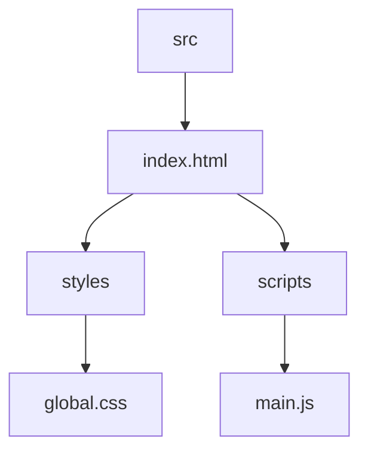

# 3D Project: Interactive 3D Visualization
## 🗂️ Description

The 3D Project is a web-based application designed to showcase interactive 3D visualizations. This project is ideal for developers, designers, and anyone interested in exploring 3D content on the web. The application provides a seamless and engaging experience, leveraging the latest web technologies to render stunning 3D graphics.

At its core, the project aims to provide an intuitive and user-friendly interface for navigating and interacting with 3D models. The application is built with a focus on performance, scalability, and maintainability, making it an excellent starting point for similar projects.

## ✨ Key Features

### **Core Features**

* Interactive 3D viewer component
* Animations powered by AOS (Animate on Scroll) library
* 3D content rendering using Spline Viewer library
* Responsive design for optimal viewing experience

### **User Experience**

* Smooth navigation and interaction with 3D models
* Engaging animations and visual effects
* Easy-to-use interface for exploring 3D content

## 🗂️ Folder Structure

## 🛠️ Tech Stack

## ⚙️ Setup Instructions

To run the project locally, follow these steps:

* Clone the repository: `git clone https://github.com/AbhiRaks007/3D-project.git`
* Navigate to the project directory: `cd 3D-project`
* Open the `index.html` file in a web browser to view the application

Note: This project does not require a backend or database setup, as it is a static web application. Simply open the `index.html` file in a web browser to experience the interactive 3D visualization.

  

<h3>Abhinandan Rakshit</h3>

No information provided.

 

  <a href="https://gitfull.vercel.app">Made by GitFull</a>

    
